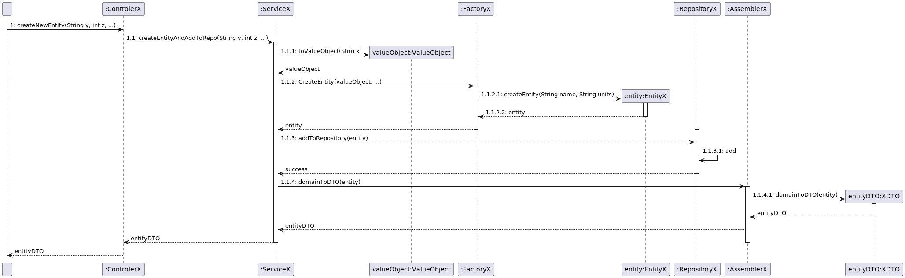

## Create entity
- Controller receives primitive types required to construct the value objects
- Controller sends the primitives to the associated service
- Service instantiates value objects
- Service sends value objects to associated factory to instantiate entity
- Factory returns entity to the service
- Service saves the entity to the repository (using auxiliary method)
- Service passes the entity to the assembler to create corresponding DTO
- Service return DTO of added object to the controller
- Controller returns DTO to the UI

### Sequence Diagram

