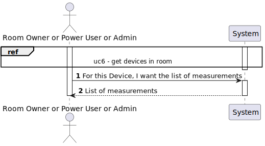
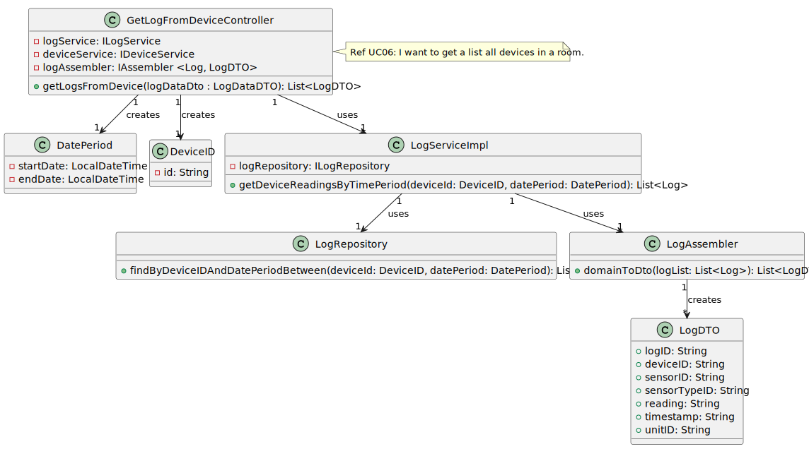
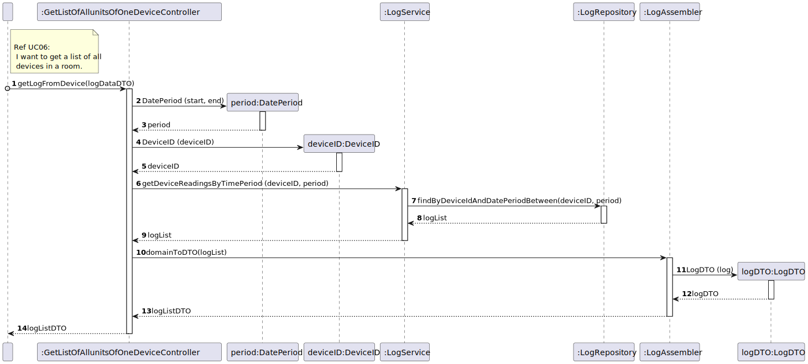

# UC11

## 0. Description

To get a log of all measurements of a device in a room, in a given period.

## 1. Analysis
A device will be selected, as well as a time frame.
The system will then return a list of all measurements recorded by the selected device during the specified period.

### 1.1. Use Case Description

TBD

### 1.2. Dependency of other use cases
This use case depends on UC03 and UC06.

### 1.3. Relevant domain aggregate model

### 1.4. System Sequence Diagram

## 2. Design

### 2.1 Class Diagram

### 2.2. Sequence Diagram

### 2.3 Applied Patterns
TBD
