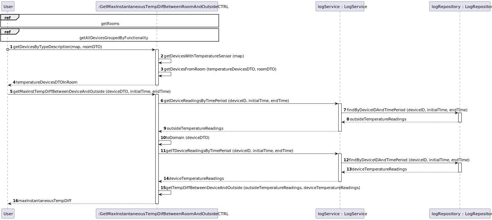

# UC12

## 0. Description

To get the maximum instantaneous temperature difference between a device in the room and the outside, in a given period.

## 1. Analysis
The system will calculate the maximum temperature difference between a device in the room 
and the outside temperature, in a given period, and provide the result.

### 1.1. Use Case Description
_To get the maximum instantaneous temperature difference between a device in the room and the outside, in a given period_

    Use Case Name: To get the maximum instantaneous temperature difference between a device in the room and the outside, in a given period

    Actor: Room Owner [or Power User, or Administrator]

    Goal: To provide to the user the maximum instantaneous temperature difference between a device in the room and the outside, in a given period.

    Preconditions:
    The user must have selected a room where the device is located.
    The system must have a mechanism for storing and accessing the temperature data of the device.

    Trigger: The user selects an option to get the maximum instantaneous temperature difference between a device in the room and the outside, in a given period.

    Basic Flow:
    1. The user selects a device with temperature functionality.
    2. The user selects a time frame.
    3. The system calculates the maximum temperature difference between the device and the outside temperature in the selected time frame.
    4. The system displays the maximum temperature difference between the device and the outside temperature in the selected time frame.

    Alternative Flows:
    1. The user selects a device that does not exist.
    2. The user selects a device that has no temperature functionality.
    3. The user selects a time frame that does not exist.
    4. The user selects a time frame that is not valid.

### 1.2. Dependency on other use cases
This use case depends on UC03 and UC09.

### 1.3. Relevant domain aggregate model

### 1.4. Customer Specifications and Clarifications
* 11/04/2024 - "Relativamente à US34, no conjunto de dados de teste não se pode assumir que os dados de diferentes sensores foram obtidos no mesmo instante.
  A probabilidade de isso acontecer na realidade é praticamente nula."

### 1.5. System Sequence Diagram

## 2. Design

### 2.1 Class Diagram

### 2.2. Sequence Diagram

* Ref 1 - Get Rooms

* Ref 2 - Get all devices grouped by functionality

### 2.3 Applied Patterns
