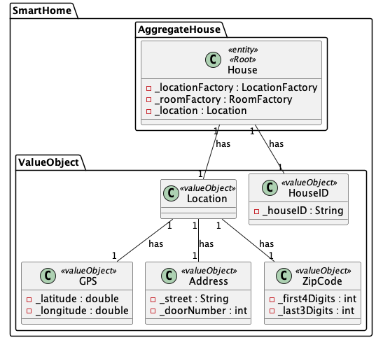

## US02: To Add Location to the House

## 0. Requirements
As an Administrator, I want to configure the location of the house.

## 1. Analysis
The location the house will have a address, GPS an Postal Code. The location the house will be added to the house.

### 1.1. Use Case Description
_To Add Location to the House_

    Use Case Name: To Add Location to the House

    Actor: Administrator

    Goal: To Add Location to the House

    Preconditions:
    
    The administrator wishes to instantiate the location of a house with its address, GPS, and postal code.

    Basic Flow: 
    Admininstrator selects option to add a location to the house.

### 1.2. Dependency of another user story
No dependencies.

### 1.3. Relevant domain model aggregates

### 1.4. Required classes
_Controller_ -> for the management of the services and the interface

_HouseService_ -> for the house management

_HouseRepository_ -> for the house storage

_HouseAssembler_ -> for the house data transfer object management

_HouseDTO_ -> for the house data transfer object

## 2. Design

### 2.1. Class Diagram

### 2.2. Sequence Diagram

### 2.3. Applied Patterns
- Single Responsibility Principle: Each class has a single responsibility, which promotes a better code organization
- Factory Method: The HouseAssembler class will be used to create the data transfer objects.
- Data Transfer Object: The HouseDTO class will be used to transfer data between the layers of the application.
- Repository: The HouseRepository is used to store and retrieve house data.

## 3. Tests
- Should instantiate US01 configure house location controller when constructor arguments are valid
- Should throw exception when house assembler is null
- Should throw exception when house service is null
- Should throw exception when house service is null and house assembler is null
- Should throw exception when house service is null and house assembler is null and house repository is null
- Should throw exception when house service is null and house assembler is null and house repository is null and house factory is null
- Should throw exception when house service is null and house assembler is null and house repository is null and house factory is null and house iD is null
- Should throw exception when house service is null and house assembler is null and house repository is null and house factory is null and house iD is null and address is null
- Should return HouseDTO when house is configured
