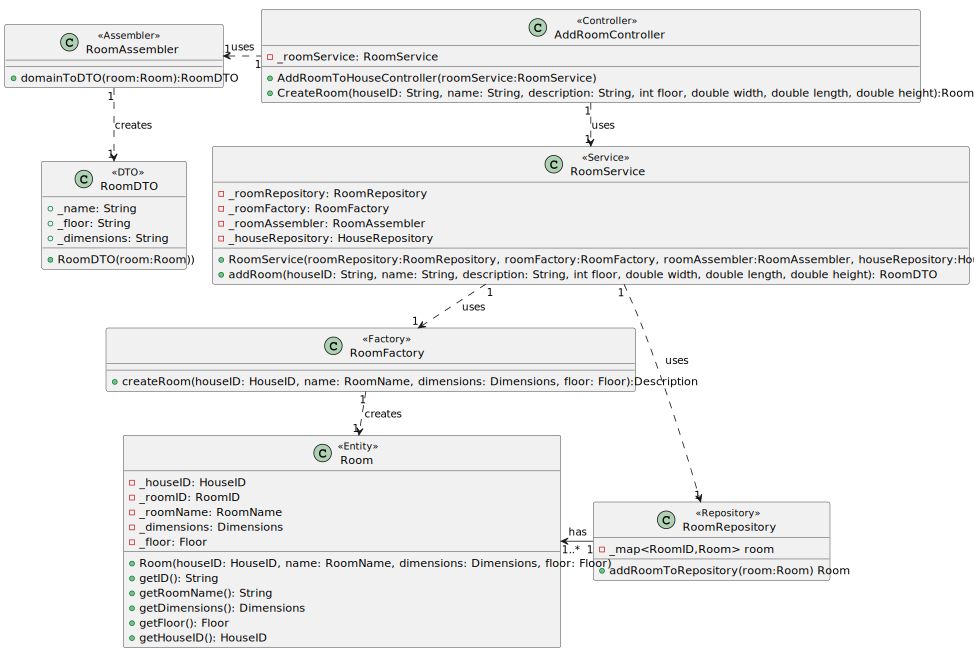
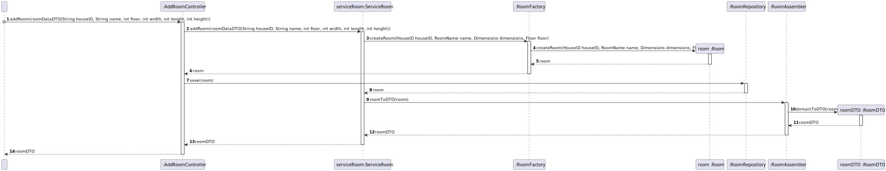

## US02: To Add Room to House

## 0. Requirements
As an Administrator, I want to add a new room to the house, in order to configure it (name, house floor and dimensions).

## 1. Analysis
The room will have a name, a floor and dimensions. The room will be added to the house.

### 1.1. Use Case Description
_To add a room to the house_

    Use Case Name: To add a room to the house

    Actor: Administrator

    Goal: To add a new room to thw house

    Preconditions:
    The Administrator has access to the rooms management interface within the system.
    The system has a mechanism for storing and accessing the rooms in the house.

    Basic Flow: 
    Admininstrator selects option to add a room to the house.
    System adds the room to the house.

### 1.2. Dependency of another user story
This user story depends on US01 (a House must exist).

### 1.3. Relevant domain model aggregates

### 1.4. Required classes
_Controller_ -> for the management of the services and the interface

_RoomService_ -> for the room management

_RoomRepository_ -> for the room storage

_RoomAssembler_ -> for the room data transfer object management

_RoomDTO_ -> for the room data transfer object

## 2. Design

### 2.1. Class Diagram

### 2.2. Sequence Diagram

### 2.3. Applied Patterns
- Single Responsibility Principle: Each class has a single responsibility, which promotes a better code organization
- Factory Method: The RoomAssembler class will be used to create the data transfer objects.
- Data Transfer Object: The RoomDTO class will be used to transfer data between the layers of the application.
- Repository: The roomRepository is used to store and retrieve room data.

## 3. Tests
- Should instantiate AddRoomToHouseController when parameters are valid
- Should throw exception if house does not exist
- Should add a new room to the house given a valid houseID, name, floor and dimensions
- Should throw exception if the house id is invalid
- Should throw exception if the room name is invalid
- Should throw exception if the room floor is invalid
- Should throw exception if the room dimensions are invalid