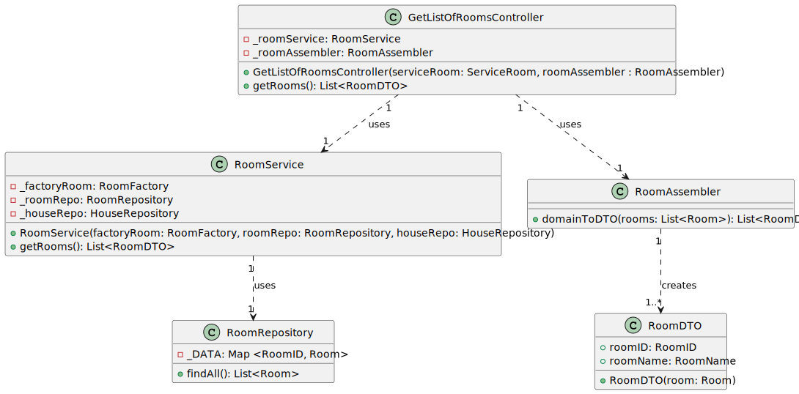
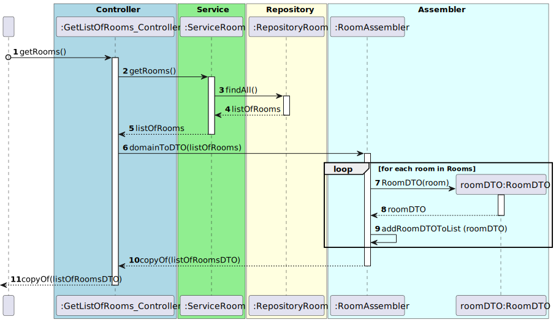

## US03 Get List of Rooms

## 1. Requirements
_As an Administrator, I want to have a list of existing rooms, so that I can choose one to edit it._

## 2. Analysis
_A collection with all the rooms in the house will be made, initially. After that, the rooms will be listed._

### 2.1. System Sequence Diagram
_To get list of rooms_

    Use Case name: To get list of rooms

    Actor: Administrator 

    Goal: To get the list of all rooms in the house

    Preconditions:
    The Administrator has access to the room management interface within the system.
    The system has a mechanism for storing and accessing the rooms in the house.
    Trigger: The Administrator selects the option to get all rooms in the house.

    Basic Flow:
    The Administrator selects the option to get all rooms in the house.
    The system provides a list with all the rooms in the house.

### 2.2. Dependency of another user story
_This user story has no dependencies._

### 2.3. Relevant domain aggregate model

### 2.4. Required classes
_Controller_ -> for the management of the services and the interface

_RoomService_ -> for the room management

_RoomRepository_ -> for the room storage

_RoomAssembler_ -> for the room data transfer object management

_RoomDTO_ -> for the room data transfer object

## 3. Design
_The team will design the best way to implement the requirements._

### 3.1. Class Diagram
 
### 3.2. Sequence Diagram

### 3.3. Applied Patterns
- Single Responsibility Principle: Each class has a single responsibility, which promotes a better code organization
- Factory Method: The RoomAssembler classe will be used to create the data transfer objects.
- Data Transfer Object: The RoomDTO class will be used to transfer data between the layers of the application.

## 4. Acceptance tests
- Should return a list of all rooms - [Test Link](../../../src/test/java/SmartHomeDDD/controller/GetListOfRoomsControllerTest.java#L114) 

