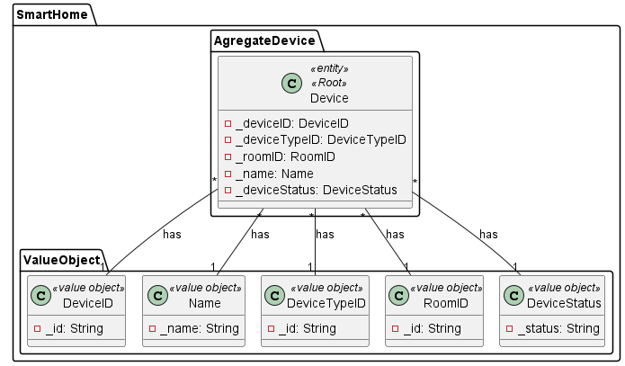
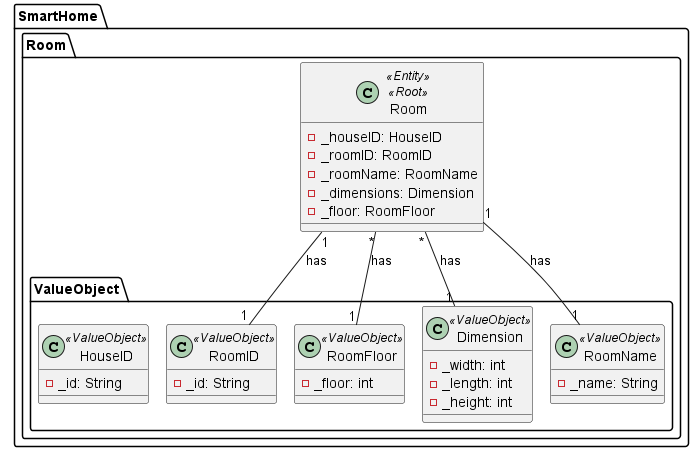
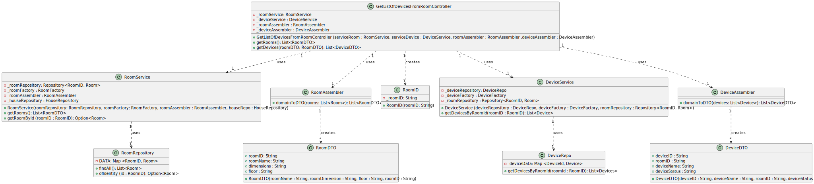

## US06 Get Devices From a Room

## 1. Requirements
_As a Room Owner (Power User or Administrator), I want to get a list of all devices in a room, so that I can manage them._

## 2. Analysis
_A collection with all the devices in the room will be made, initially. After that, the devices will be listed._

### 2.1. System Sequence Diagram
_To get list of devices in a room_

    Use Case name: To get list of devices in a room

    Actor: Room Owner / Power User / Administrator 

    Goal: To get the list of all devices in a room

    Preconditions:
    The Room Owner / Power User / Administrator has access to the device management interface within the system.
    The system has a mechanism for storing and accessing the devices in the room.
    Trigger: The Room Owner / Power User / Administrator selects the option to get all devices in the room.

    Basic Flow:
    The Room Owner / Power User / Administrator selects the option to get all devices in the room.
    The system provides a list with all the devices in the room.

### 2.2. Dependency of another user story
_This user story has dependencies with US03. This user story, requires the user to have a list of all rooms in the house._

### 2.3. Relevant domain aggregate model

### 2.4. Required classes
_Controller_ -> for the management of the services and the interface

_RoomService_ -> for the room management

_RoomRepository_ -> for the room storage

_RoomAssembler_ -> for the room data transfer object management

_RoomDTO_ -> for the room data transfer object

_DeviceService_ -> for the device management

_DeviceRepository_ -> for the device storage

_DeviceAssembler_ -> for the device data transfer object management

_DeviceDTO_ -> for the device data transfer object

## 3. Design
_The team will design the best way to implement the requirements._

### 3.1. Class Diagram

### 3.2. Sequence Diagram

### 3.3. Applied Patterns
- Single Responsibility Principle: Each class has a single responsibility, which promotes a better code organization
- Factory Method: The RoomAssembler and DeviceAssembler classes will be used to create the data transfer objects.
- Data Transfer Object: The RoomDTO and DeviceDTO classes will be used to transfer data between the layers of the application.

## 4. Acceptance tests
- Should return a list of devices in a room - [Test Link](../../../src/test/java/SmartHomeDDD/controller/GetDevicesFromRoomControllerTest.java#L50) 

      