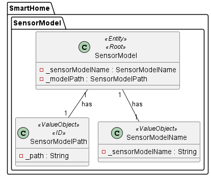
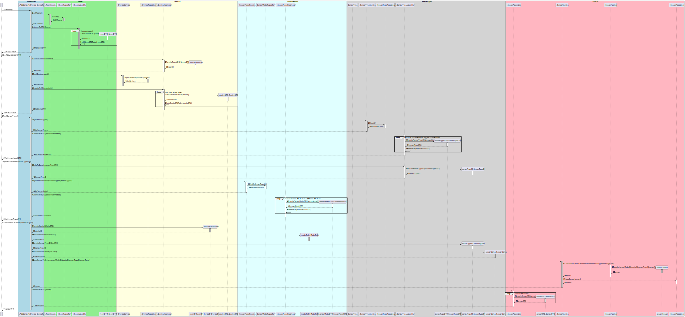

## US07 Add a sensor to an existing device in a room.

## 1. Requirements
_As a Power User (or Administrator), I want to add a sensor to an existing device in
a room. The sensor must be of a model of an existing type of sensor._

_The Power User (or Administrator) wants to add a sensor to an existing device in a room. The sensor must be of a model of an existing type of sensor. So to add a sensor to a device we will first provide all the rooms in the house, then all the devices in a room and finally all the sensor models supported by the system._

### 1.1. System Sequence Diagram

### 1.3. Dependency of another user story
_This user story has dependency on US03 and US06.

_However we assume that the system already has configured rooms, devices and sensor types_

### 1.4. Relevant domain model aggregates

## 2. Analysis
_To tackle the current US we will be using the Sensor Service. Since Sensor only exists with an associated Device the service should know the Device repository, to provide a list of devices and check if the given deviceID is on the Repo._

### 2.1. Class Diagram

### 2.2. Sequence Diagram

- Factory Method: The sensor is created using the factory pattern, that is responsible for creating all supported sensor models
- Single Responsibility Principle: Each class has a single responsibility, this promotes a better code organization and maintainability.
- Data Transfer Object: The sensorDTO is used to transfer the sensor data between the controller and the service layer.
- Repository: The sensorRepository is used to store and retrieve sensor data.

## 3. Tests
_The team will design the best way to test the requirements._

- Should return a list of devices grouped by functionality
- Should throw exception if no devices exists
- The list of devices grouped by functionality should be returned
