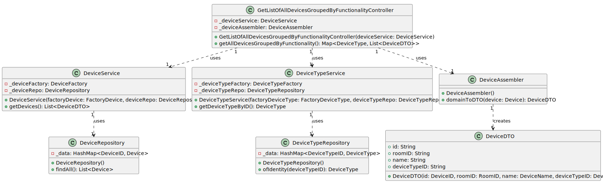

## US09 Get all devices grouped by functionality

## 0. Requirements
_As a Power User (or Administrator), I want to get a list of all devices in a house, grouped by device functionality types.
It must include device location._

## 1. Analysis
_A collection with all the devices in the house will be made, initially. After that, the devices will be grouped by each of their functionality type._

### 1.1. System Sequence Diagram

### 1.2. Use Case description
_To get list of devices grouped by functionality_
    
        Use Case Name: To get list of devices grouped by functionality
    
        Actor: Power User / Administrator
    
        Goal: To get the list of all devices in the house grouped by functionality
    
        Preconditions:
        The Power User / Administrator has access to the device management interface within the system.
        The system has a mechanism for storing and accessing the devices in the house.

        Trigger: The Power User / Administrator selects the option to get all devices in the house grouped by functionality.
    
        Basic Flow:
        The Power User / Administrator selects the option to get all devices grouped by functionality.
        The system provides a list with all the devices in the house, grouped by functionality.
    
        Alternative Flows:
        Non-existing list: If there are no devices in the house, the list is null.

### 1.3. Dependency of another user story
_This user story has no dependencies on other user stories._

### 1.4. Relevant domain aggregate model 

### 1.5. Required classes
_Controller_ -> for the management of the services and the interface

_DeviceService_ -> for the device management

_DeviceRepository_ -> for the device storage

_DeviceAssembler_ -> for the device data transfer object management

_DeviceDTO_ -> for the device data transfer object

## 2. Design
_The team will design the best way to implement the requirements._
### 2.1. Class Diagram

### 2.2. Sequence Diagram

### 2.3. Applied Patterns
- Single Responsibility Principle: Each class has a single responsibility, which promotes a better code organization 
and maintainability.
- Data Transfer Object: The DeviceDTO is used to transfer the Device 
data, respectively, between the service layer and the controller, which guarantees protection for the domain.
- Repository: The DeviceRepository is used to store and retrieve the Device data.

## 3. Acceptance Tests
- Should return a list of devices grouped by functionality when devices exist in the house and have different functionalities - [Test Link](../../../test/java/SmartHomeDDD/controller/GetListOfAllDevicesGroupedByFunctionalityTest.java#L130)
- Should return a list of devices grouped by functionality when devices exist in the house and have the same functionality - [Test Link](../../../test/java/SmartHomeDDD/controller/GetListOfAllDevicesGroupedByFunctionalityTest.java#L202)