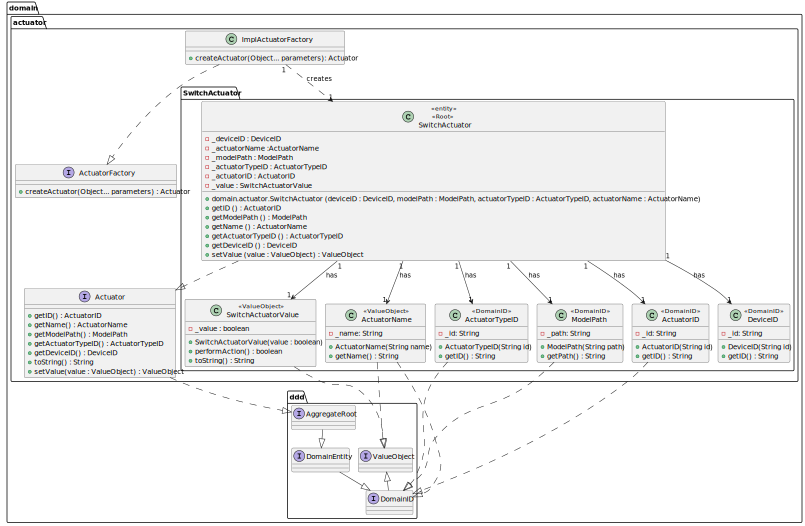

## US13 Switch Actuator

## 0. Requirements
_As Product Owner, I want the system to have a type of actuator that switches a
load ON/OFF._

## 1. Analysis
_An actuator model (with a corresponding type) capable of switching a load ON/OFF will be included in the system._

### 1.1. System Sequence Diagram
Not applicable.

### 1.2. Use Case description
_To have an actuator that switches a load ON/OFF_

        Use Case Name: To have an actuator that switches a load ON/OFF
    
        Actor: Product Owner
    
        Goal: To have an actuator that switches a load ON/OFF

### 1.3. Dependency of another user story
_This user story does not depend on another._

### 1.4. Relevant domain aggregate model

### 1.5. Required classes
_SwitchActuator_ -> for the actuator class with its functionality

_SwitchActuatorValue_ -> for the value of the actuator to be set

_ImplFactoryActuator_ -> for the actuator instantiation

## 2. Design
_The team will design the best way to implement the requirements._

### 2.1. Class Diagram

### 2.2. Sequence Diagram
Not applicable.
### 2.3. Applied Patterns
- Single Responsibility Principle: Each class has a single responsibility, which promotes a better code organization
  and maintainability.

## 3 Acceptance Tests
_The actuator should be able to switch a load ON/OFF:_
- [Test Link](../../../test/java/SmartHomeDDD/domain/Actuator/SwitchActuatorTest.java#L272);
- [Test Link](../../../test/java/SmartHomeDDD/domain/Actuator/SwitchActuatorTest.java#L300);