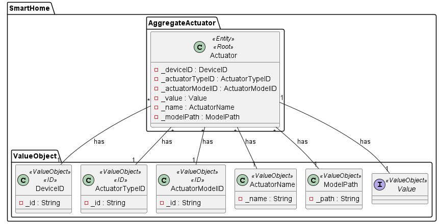
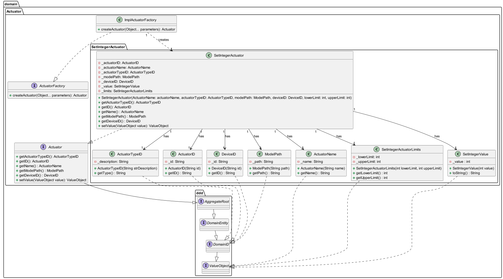

## US15 Set Integer Actuator

## 0. Requirements
_As a Product Owner, I want the system to have a type of actuator that sets an integer value in the range
defined by [lower limit, upper limit]._

## 1. Analysis
_An actuator model (with a corresponding type) capable of setting an integer value between two limits will be included in the system._

### 1.1. System Sequence Diagram
Not applicable.

### 1.2. Use Case description
_To have an actuator that sets an integer value_
    
        Use Case Name: To have an actuator that sets an integer value in a range
    
        Actor: Product Owner
    
        Goal: To have an actuator that sets an integer value in a range

### 1.3. Dependency of another user story
_This user story does not depend on another._

### 1.4. Relevant domain aggregate model 

### 1.5. Required classes
_SetIntegerActuator_ -> for the actuator class with its functionality

_SetIntegerValue_ -> for the value of the integer to be set

_ImplFactoryActuator_ -> for the actuator instantiation

## 2. Design
_The team will design the best way to implement the requirements._
### 2.1. Class Diagram

### 2.2. Sequence Diagram
Not applicable.
### 2.3. Applied Patterns
- Single Responsibility Principle: Each class has a single responsibility, which promotes a better code organization 
and maintainability.

## 3 Acceptance Tests
- The SetIntegerActuator should be able to set an integer value in the range defined by [lower limit, upper limit] - [Test Link](../../../src/test/java/SmartHomeDDD/domain/Actuator/SetIntegerActuatorTest.java#L301)