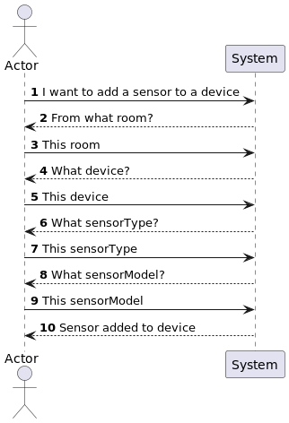

## US21 As Product Owner, I want the system to have a type of sensor that gives the sunset instant for a given calendar date

## 1. Requirements
_As a Product Owner, I want the system to have a type of sensor that gives the sunset instant for a given calendar date._

_The system should have a sensor type that provides the sunset instant for a given calendar date. The sensor type should be associated with the unit of time._

### 1.1. System Sequence Diagram for add Sensor

### 1.2. Use Case description
_Sunset Time Sensor_
    
        Use Case Name: Sunset Time Sensor
        
        Actor: Product Owner
        
        Goal: To have a sensor that gives the sunset instant for a given calendar date
    
        Preconditions:
        The system has a mechanism for storing and accessing the sensors.
        The system has a mechanism for storing and accessing the supported units.
        The product owner didn't specify the time precision of the sunset instant when asked.

### 1.3. Dependency of another user story

### 1.4. Relevant domain model aggregates

## 2. Analysis
### 2.1. Class Diagram

- Factory Method: The senorType is created using the factory pattern, that is responsible for creating all supported sensor types
- Single Responsibility Principle: Each class has a single responsibility, this promotes a better code organization and maintainability.

## 3. Tests

- Should Throw Exception When GPS Is Invalid [Test Link](../../../test/java/SmartHomeDDD/controller/SunsetTimeSensorTest.java#L89)
- Should Return Sunset Time For Current Day [Test Link](../../../test/java/SmartHomeDDD/controller/SunsetTimeSensorTest.java#L103)
- Should Return Sunset Time For Given Day [Test Link](../../../test/java/SmartHomeDDD/controller/SunsetTimeSensorTest.java#L120)
- Should Throw Exception SensorType Not Appropriate [Test Link](../../../test/java/SmartHomeDDD/controller/SunsetTimeSensorTest.java#L47)