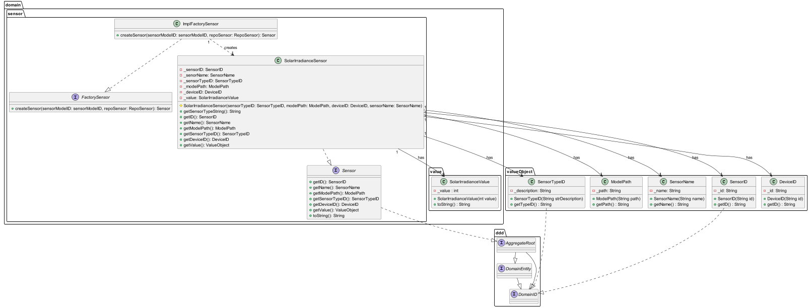

## US23 Solar Irradiance Sensor

## 0. Requirements
_As a Product Owner, I want the system to have a type of sensor that gives the solar irradiance (W/m^2)._

## 1. Analysis
_A sensor model (with a corresponding type) capable of giving the solar irradiance will be included in the system._

### 1.1. System Sequence Diagram
Not applicable.

### 1.2. Use Case description
_To have a sensor that gives the solar irradiance._
    
        Use Case Name: To have a sensor that gives the solar irradiance
    
        Actor: Product Owner
    
        Goal: To have a sensor that gives the solar irradiance

### 1.3. Dependency of another user story
_This user story does not depend on another._

### 1.4. Relevant domain aggregate model 

### 1.5. Required classes
_SolarIrradianceSensor_ -> for the sensor class with its functionality

_SolarIrradianceValue_ -> for the value of the solar irradiance

_ImplFactorySensor_ -> for the sensor instantiation

## 2. Design
_The team will design the best way to implement the requirements._
### 2.1. Class Diagram

### 2.2. Sequence Diagram
Not applicable.
### 2.3. Applied Patterns
- Single Responsibility Principle: Each class has a single responsibility, which promotes a better code organization 
and maintainability.

## 3. Acceptance Tests

- The SolarIrradianceSensor should be able to return the value of the solar irradiance - [Test Link](../../../src/test/java/SmartHomeDDD/domain/Sensor/SolarIrradianceSensorTest.java#L243)