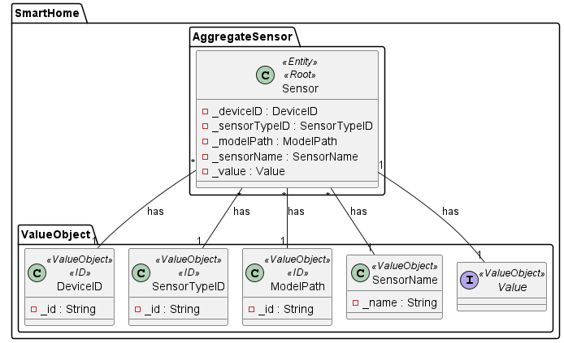
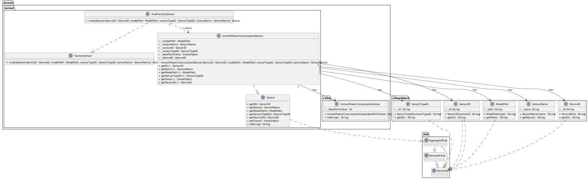

## US24 Instant Power Consumption Sensor

## 1. Requirements

_As a Product Owner, I want the system to have a type of sensor that gives the power consumption in a given instant (w)._

## 2. Analysis
_A sensor model (with a corresponding type) capable of giving the power consumption in a given instant will be included in the system._

### 2.1. System Sequence Diagram
Not applicable.

### 2.2. Use Case description
_To have a sensor that gives the power consumption in a given instant._

        Use Case Name: To have a sensor that gives the power consumption in a given instant
    
        Actor: Product Owner
    
        Goal: To have a sensor that gives the power consumption in a given instant

### 2.3. Dependency of another user story
_This user story does not depend on another._

### 2.4. Relevant domain aggregate model

### 2.5. Required classes
_InstantPowerConsumptionSensor_ -> for the sensor class with its functionality

_InstantPowerConsumptionValue_ -> for the value of the power consumption in a given instant

_ImplFactorySensor_ -> for the sensor instantiation

## 3. Design
_The team will design the best way to implement the requirements._

### 3.1. Class Diagram

### 3.2. Sequence Diagram
Not applicable.
### 3.3. Applied Patterns
- Single Responsibility Principle: Each class has a single responsibility, which promotes a better code organization

## 4. Acceptance Tests

- The InstantPowerConsumptionSensor should be able to return the value of the power consumption in a given instant - [Test Link](../../../test/java/SmartHomeDDD/domain/Sensor/InstantPowerConsumptionSensorTest.java#L243)

